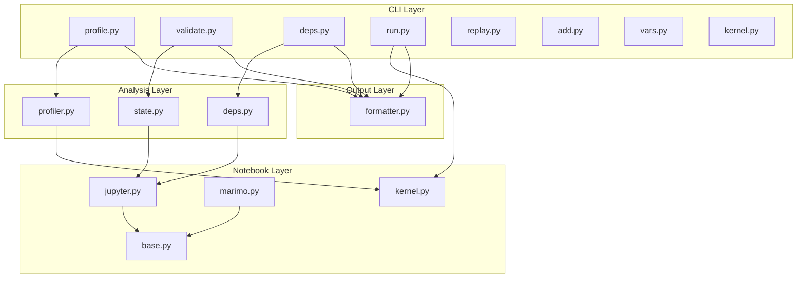

# DASA Architecture

Technical architecture of the DASA Data Science Agent toolkit.

## Overview

```
┌─────────────────────────────────────────────────────────────────┐
│                        DASA Architecture                        │
├─────────────────────────────────────────────────────────────────┤
│                                                                 │
│   CLI Layer                                                     │
│   ─────────                                                     │
│   Typer-based commands that agents call via bash                │
│   └── dasa/cli/*.py                                             │
│                                                                 │
│   Analysis Layer                                                │
│   ──────────────                                                │
│   Engines for profiling, state analysis, dependency tracking    │
│   └── dasa/analysis/*.py                                        │
│                                                                 │
│   Notebook Layer                                                │
│   ──────────────                                                │
│   Format adapters and kernel management                         │
│   └── dasa/notebook/*.py                                        │
│                                                                 │
│   Output Layer                                                  │
│   ────────────                                                  │
│   LLM-friendly formatting for all output                        │
│   └── dasa/output/*.py                                          │
│                                                                 │
└─────────────────────────────────────────────────────────────────┘
```

## Component Diagram



---

## Layer Details

### CLI Layer (`dasa/cli/`)

Entry point for all commands. Uses Typer for CLI framework.

```python
# dasa/cli/main.py
import typer

app = typer.Typer()

@app.command()
def profile(
    notebook: str,
    var: str = typer.Option(..., "--var", "-v"),
):
    """Profile a variable in the notebook."""
    from dasa.analysis.profiler import Profiler
    from dasa.notebook.jupyter import JupyterAdapter
    from dasa.output.formatter import format_profile
    
    adapter = JupyterAdapter(notebook)
    profiler = Profiler(adapter)
    result = profiler.profile(var)
    print(format_profile(result))
```

**Files:**
- `main.py` - Typer app and command routing
- `profile.py` - `dasa profile` command
- `validate.py` - `dasa validate` command
- `deps.py` - `dasa deps` command
- `run.py` - `dasa run` command
- `replay.py` - `dasa replay` command
- `add.py` - `dasa add/edit/delete` commands
- `vars.py` - `dasa vars` command
- `kernel.py` - `dasa kernel` command
- `stale.py` - `dasa stale` command

---

### Analysis Layer (`dasa/analysis/`)

Core analysis engines that power the diagnostic capabilities.

#### Profiler (`profiler.py`)

Deep data profiling for DataFrames and other objects.

```python
@dataclass
class ColumnProfile:
    name: str
    dtype: str
    unique_count: int
    null_count: int
    null_percent: float
    min_value: Any = None
    max_value: Any = None
    mean_value: float = None
    sample_values: list = None
    issues: list[str] = None

@dataclass
class DataFrameProfile:
    shape: tuple[int, int]
    memory_bytes: int
    columns: list[ColumnProfile]
    issues: list[str]
    sample_rows: list[dict]

class Profiler:
    def __init__(self, kernel: KernelManager):
        self.kernel = kernel
    
    def profile(self, var_name: str) -> DataFrameProfile:
        """Generate deep profile of a DataFrame."""
        # Execute profiling code in kernel
        code = f"""
import json
df = {var_name}
profile = {{
    'shape': df.shape,
    'dtypes': df.dtypes.to_dict(),
    'nulls': df.isnull().sum().to_dict(),
    'describe': df.describe().to_dict(),
    'sample': df.head(5).to_dict('records')
}}
print(json.dumps(profile))
"""
        result = self.kernel.execute(code)
        return self._parse_profile(result)
```

#### State Analyzer (`state.py`)

Analyzes notebook state consistency.

```python
@dataclass
class StateIssue:
    severity: str  # "error", "warning"
    cell_index: int
    message: str
    suggestion: str = None

@dataclass
class StateAnalysis:
    is_consistent: bool
    issues: list[StateIssue]
    execution_order: list[int]
    correct_order: list[int]

class StateAnalyzer:
    def analyze(self, notebook: NotebookAdapter) -> StateAnalysis:
        """Analyze notebook for state consistency issues."""
        issues = []
        
        # Check for stale outputs
        for cell in notebook.code_cells:
            if cell.is_stale:
                issues.append(StateIssue(
                    severity="warning",
                    cell_index=cell.index,
                    message="Output is stale (code modified after execution)"
                ))
        
        # Check for undefined references
        defined = set()
        for cell in notebook.code_cells:
            for ref in cell.references:
                if ref not in defined:
                    issues.append(StateIssue(
                        severity="error",
                        cell_index=cell.index,
                        message=f"Uses undefined variable '{ref}'"
                    ))
            defined.update(cell.definitions)
        
        return StateAnalysis(
            is_consistent=len([i for i in issues if i.severity == "error"]) == 0,
            issues=issues,
            execution_order=notebook.execution_order,
            correct_order=self._compute_correct_order(notebook)
        )
```

#### Dependency Graph (`deps.py`)

Builds and analyzes cell dependency graph.

```python
@dataclass
class CellNode:
    index: int
    cell_type: str
    definitions: set[str]
    references: set[str]
    preview: str

@dataclass 
class DependencyGraph:
    nodes: list[CellNode]
    edges: dict[int, list[int]]  # cell -> downstream cells
    
    def get_downstream(self, cell_index: int) -> list[int]:
        """Get all cells affected by changes to this cell."""
        affected = set()
        queue = [cell_index]
        while queue:
            current = queue.pop(0)
            for downstream in self.edges.get(current, []):
                if downstream not in affected:
                    affected.add(downstream)
                    queue.append(downstream)
        return sorted(affected)

class DependencyAnalyzer:
    def build_graph(self, notebook: NotebookAdapter) -> DependencyGraph:
        """Build dependency graph from notebook cells."""
        nodes = []
        edges = {}
        
        # Parse each cell to find definitions and references
        for cell in notebook.code_cells:
            defs, refs = self._parse_cell(cell.source)
            nodes.append(CellNode(
                index=cell.index,
                cell_type=cell.cell_type,
                definitions=defs,
                references=refs,
                preview=cell.source[:50]
            ))
        
        # Build edges based on variable flow
        for node in nodes:
            edges[node.index] = []
            for other in nodes:
                if other.index > node.index:
                    if node.definitions & other.references:
                        edges[node.index].append(other.index)
        
        return DependencyGraph(nodes=nodes, edges=edges)
```

---

### Notebook Layer (`dasa/notebook/`)

Format adapters and kernel management.

#### Base Adapter (`base.py`)

Abstract interface for all notebook formats.

```python
from abc import ABC, abstractmethod
from dataclasses import dataclass

@dataclass
class Cell:
    index: int
    cell_type: str  # "code", "markdown", "raw"
    source: str
    outputs: list[dict] = None
    execution_count: int = None
    metadata: dict = None

class NotebookAdapter(ABC):
    @abstractmethod
    def load(self, path: str) -> None:
        """Load notebook from file."""
        pass
    
    @abstractmethod
    def save(self, path: str = None) -> None:
        """Save notebook to file."""
        pass
    
    @property
    @abstractmethod
    def cells(self) -> list[Cell]:
        """Get all cells."""
        pass
    
    @property
    def code_cells(self) -> list[Cell]:
        """Get only code cells."""
        return [c for c in self.cells if c.cell_type == "code"]
    
    @abstractmethod
    def add_cell(self, cell: Cell, index: int = None) -> None:
        """Add a cell at the specified index."""
        pass
    
    @abstractmethod
    def update_cell(self, index: int, source: str) -> None:
        """Update cell source code."""
        pass
    
    @abstractmethod
    def delete_cell(self, index: int) -> None:
        """Delete a cell."""
        pass
```

#### Jupyter Adapter (`jupyter.py`)

Implementation for Jupyter .ipynb format.

```python
import nbformat

class JupyterAdapter(NotebookAdapter):
    def __init__(self, path: str = None):
        self.path = path
        self._notebook = None
        if path:
            self.load(path)
    
    def load(self, path: str) -> None:
        self.path = path
        with open(path) as f:
            self._notebook = nbformat.read(f, as_version=4)
    
    def save(self, path: str = None) -> None:
        path = path or self.path
        with open(path, 'w') as f:
            nbformat.write(self._notebook, f)
    
    @property
    def cells(self) -> list[Cell]:
        return [
            Cell(
                index=i,
                cell_type=c.cell_type,
                source=c.source,
                outputs=getattr(c, 'outputs', None),
                execution_count=getattr(c, 'execution_count', None),
                metadata=c.metadata
            )
            for i, c in enumerate(self._notebook.cells)
        ]
    
    @property
    def execution_order(self) -> list[int]:
        """Get actual execution order from execution counts."""
        cells_with_count = [
            (i, c.execution_count)
            for i, c in enumerate(self._notebook.cells)
            if c.cell_type == "code" and c.execution_count
        ]
        return [i for i, _ in sorted(cells_with_count, key=lambda x: x[1])]
```

#### Kernel Manager (`kernel.py`)

Manages Jupyter kernel for code execution.

```python
from jupyter_client import KernelManager as JupyterKernelManager
import queue

@dataclass
class ExecutionResult:
    success: bool
    stdout: str
    stderr: str
    result: Any
    error: str = None
    execution_time: float = 0

class KernelManager:
    def __init__(self, kernel_name: str = "python3"):
        self.kernel_name = kernel_name
        self._km = None
        self._kc = None
    
    def start(self) -> None:
        """Start the kernel."""
        self._km = JupyterKernelManager(kernel_name=self.kernel_name)
        self._km.start_kernel()
        self._kc = self._km.client()
        self._kc.start_channels()
        self._kc.wait_for_ready()
    
    def execute(self, code: str, timeout: int = 300) -> ExecutionResult:
        """Execute code and return result."""
        if not self._kc:
            self.start()
        
        msg_id = self._kc.execute(code)
        
        stdout = []
        stderr = []
        result = None
        error = None
        
        while True:
            try:
                msg = self._kc.get_iopub_msg(timeout=timeout)
            except queue.Empty:
                return ExecutionResult(
                    success=False,
                    stdout="".join(stdout),
                    stderr="".join(stderr),
                    result=None,
                    error="Execution timed out"
                )
            
            if msg['parent_header'].get('msg_id') != msg_id:
                continue
            
            msg_type = msg['msg_type']
            content = msg['content']
            
            if msg_type == 'stream':
                if content['name'] == 'stdout':
                    stdout.append(content['text'])
                elif content['name'] == 'stderr':
                    stderr.append(content['text'])
            elif msg_type == 'execute_result':
                result = content['data']
            elif msg_type == 'error':
                error = f"{content['ename']}: {content['evalue']}"
            elif msg_type == 'status' and content['execution_state'] == 'idle':
                break
        
        return ExecutionResult(
            success=error is None,
            stdout="".join(stdout),
            stderr="".join(stderr),
            result=result,
            error=error
        )
    
    def restart(self) -> None:
        """Restart the kernel."""
        if self._km:
            self._km.restart_kernel()
            self._kc.wait_for_ready()
    
    def shutdown(self) -> None:
        """Shutdown the kernel."""
        if self._km:
            self._km.shutdown_kernel()
```

---

### Output Layer (`dasa/output/`)

Formats output for LLM consumption.

#### Formatter (`formatter.py`)

```python
from rich.console import Console
from rich.table import Table

def format_profile(profile: DataFrameProfile) -> str:
    """Format DataFrame profile for display."""
    lines = []
    
    # Header
    lines.append(f"DataFrame: {profile.name}")
    lines.append(f"Shape: {profile.shape[0]:,} rows × {profile.shape[1]} columns")
    lines.append(f"Memory: {format_bytes(profile.memory_bytes)}")
    lines.append("")
    
    # Columns
    lines.append("Columns:")
    for col in profile.columns:
        line = f"  {col.name:<15} {col.dtype:<10} "
        
        if col.dtype in ('int64', 'float64'):
            line += f"min={col.min_value}, max={col.max_value}, mean={col.mean_value:.1f}"
        elif col.dtype == 'object':
            line += f"{col.unique_count} unique"
        
        if col.null_count > 0:
            line += f"\n{' '*27}⚠ {col.null_count} nulls ({col.null_percent:.1f}%)"
        
        if col.issues:
            for issue in col.issues:
                line += f"\n{' '*27}⚠ {issue}"
        
        lines.append(line)
    
    # Issues summary
    if profile.issues:
        lines.append("")
        lines.append("Data Quality Issues:")
        for issue in profile.issues:
            lines.append(f"  ⚠ {issue}")
    
    return "\n".join(lines)

def format_error(error: str, context: dict) -> str:
    """Format error with helpful context for LLMs."""
    lines = []
    
    lines.append(f"Error: {error}")
    lines.append("")
    
    if 'line' in context:
        lines.append(f"Context:")
        lines.append(f"  Line {context['line_number']}: {context['line']}")
    
    if 'available' in context:
        lines.append("")
        lines.append(f"Available: {', '.join(context['available'])}")
    
    if 'suggestion' in context:
        lines.append("")
        lines.append(f"Suggestion: {context['suggestion']}")
    
    return "\n".join(lines)
```

---

## Data Flow

### Profile Command Flow

```
User: dasa profile notebook.ipynb --var df

1. CLI parses arguments
2. JupyterAdapter loads notebook.ipynb
3. KernelManager starts kernel (if needed)
4. Profiler generates profiling code
5. KernelManager executes code
6. Profiler parses results
7. Formatter creates output
8. CLI prints to stdout
```

### Validate Command Flow

```
User: dasa validate notebook.ipynb

1. CLI parses arguments
2. JupyterAdapter loads notebook.ipynb
3. StateAnalyzer parses all cells
4. StateAnalyzer checks execution order
5. StateAnalyzer checks variable references
6. StateAnalyzer detects stale outputs
7. Formatter creates output
8. CLI prints to stdout
```

---

## Extension Points

### Adding a New Notebook Format

1. Create adapter in `dasa/notebook/`:

```python
# dasa/notebook/marimo.py
class MarimoAdapter(NotebookAdapter):
    def load(self, path: str) -> None:
        # Parse .py file with @app.cell decorators
        ...
```

2. Register in factory:

```python
# dasa/notebook/__init__.py
def get_adapter(path: str) -> NotebookAdapter:
    if path.endswith('.ipynb'):
        return JupyterAdapter(path)
    elif path.endswith('.py'):
        return MarimoAdapter(path)
```

### Adding a New Command

1. Create command file in `dasa/cli/`:

```python
# dasa/cli/newcmd.py
import typer

def newcmd(notebook: str, option: str = None):
    """Description of new command."""
    ...
```

2. Register in main app:

```python
# dasa/cli/main.py
from dasa.cli.newcmd import newcmd
app.command()(newcmd)
```

---

## Dependencies

```toml
[project]
dependencies = [
    "nbformat>=5.9",          # Jupyter notebook parsing
    "nbclient>=0.10",         # Notebook execution  
    "jupyter-client>=8.0",    # Kernel communication
    "typer>=0.12",            # CLI framework
    "rich>=13.0",             # Terminal formatting
    "pandas>=2.0",            # For data profiling
]

[project.optional-dependencies]
dev = [
    "pytest>=7.0",
    "pytest-asyncio>=0.21",
    "black>=23.0",
    "ruff>=0.1",
]
```
