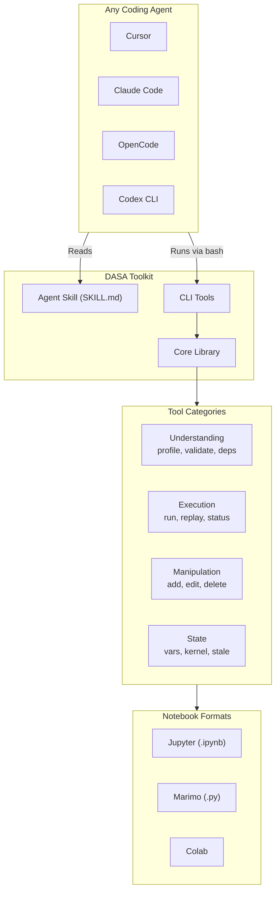

# DASA: Data Science Agent

## Overview

Build an open source Data Science Agent toolkit that gives coding agents the specialized capabilities they need for notebook-based data science work - data understanding, state management, execution control, and reproducibility verification.

## Key Design Decisions

| Decision | Choice | Rationale |
|----------|--------|-----------|
| **Eval first** | Build evaluation before features | Ensures measurable progress |
| State persistence | `.dasa/` folder | Non-invasive, don't modify notebook metadata |
| Async execution | Deferred to Phase 6 | Complex infrastructure, not MVP-critical |
| Rich output description | Simple heuristics first | Vision API is stretch goal |
| MCP server | Deferred to Phase 7 | CLI is universal, MCP is optimization |
| Phase ordering | State before Manipulation | State tools align with diagnostic value prop |

## Implementation Sprints

Detailed sprint documentation with code examples and acceptance criteria:

| Sprint | Name | Duration | Focus | Doc |
|--------|------|----------|-------|-----|
| **0** | Evaluation | 2-3 days | Test infrastructure | [SPRINT-00](sprints/SPRINT-00.md) |
| **1** | Setup & Core | 2-3 days | Foundation | [SPRINT-01](sprints/SPRINT-01.md) |
| **2** | Understanding | 3-4 days | MVP Core | [SPRINT-02](sprints/SPRINT-02.md) |
| **3** | Execution | 2-3 days | MVP Complete | [SPRINT-03](sprints/SPRINT-03.md) |
| **4** | State | 2 days | Enhancement | [SPRINT-04](sprints/SPRINT-04.md) |
| **5** | Manipulation | 2 days | Enhancement | [SPRINT-05](sprints/SPRINT-05.md) |
| **6** | Info & Async | 3 days | Nice-to-have | [SPRINT-06](sprints/SPRINT-06.md) |
| **7** | Extensions | 3-4 days | Stretch | [SPRINT-07](sprints/SPRINT-07.md) |

See [sprints/README.md](sprints/README.md) for sprint overview and dependencies.

### Sprint Summary

**Sprint 0: Evaluation Infrastructure (FIRST)**
- Test notebooks (clean, messy, broken, complex, unreproducible)
- Task definitions (12-18 tasks across 6 categories)  
- Eval harness (runner, checker, metrics)
- Baseline metrics

**Sprint 1: Project Setup & Core**
- pyproject.toml, package structure
- Agent skill (SKILL.md)
- Jupyter adapter, kernel manager, AST parser

**Sprint 2: Understanding Tools (MVP Core)**
- `dasa profile` - data profiling
- `dasa validate` - state checking
- `dasa deps` - dependency analysis

**Sprint 3: Execution Tools (MVP Complete)**
- `dasa run` - cell execution with context
- `dasa replay` - reproducibility verification

**Sprint 4: State Tools**
- `dasa vars`, `dasa stale`, `dasa kernel`

**Sprint 5: Manipulation Tools**
- `dasa add`, `dasa edit`, `dasa delete`, `dasa move`

**Sprint 6: Info Tools & Async**
- `dasa info`, `dasa cells`, `dasa outputs`
- Async execution with `--async`, `dasa status`

**Sprint 7: Extensions (Stretch)**
- Marimo adapter, MCP server, rich outputs

---

## MVP Definition

**MVP = Phase 0 + Phase 1 + Phase 2 + Phase 3**

| Phase | Deliverable | Success Metric |
|-------|-------------|----------------|
| **Phase 0** | Evaluation infrastructure + baseline | Baseline metrics documented |
| **Phase 1** | Project setup + core libs | Package installs, tests pass |
| **Phase 2** | Understanding tools | Measurable improvement on DU, SR, DR tasks |
| **Phase 3** | Execution tools | Measurable improvement on BF, RP tasks |

With MVP complete, an agent can:
1. ✅ Understand data (`profile`)
2. ✅ Check state consistency (`validate`)
3. ✅ See dependencies (`deps`)
4. ✅ Execute cells with context (`run`)
5. ✅ Verify reproducibility (`replay`)

**And we can prove it works** with before/after metrics.

---

## Development Workflow

```
┌─────────────────────────────────────────────────────────────────┐
│                   Test-Driven Development                       │
├─────────────────────────────────────────────────────────────────┤
│                                                                 │
│  1. Build Eval (Phase 0)                                        │
│     └── Create test notebooks, tasks, harness                   │
│                                                                 │
│  2. Establish Baseline                                          │
│     └── Run eval WITHOUT DASA → record metrics                  │
│                                                                 │
│  3. Build Feature (Phase N)                                     │
│     └── Implement tool (e.g., `dasa profile`)                   │
│                                                                 │
│  4. Measure Improvement                                         │
│     └── Run eval WITH new tool → compare to baseline            │
│                                                                 │
│  5. Repeat for each feature                                     │
│     └── Each tool should show improvement on relevant tasks     │
│                                                                 │
└─────────────────────────────────────────────────────────────────┘
```

### Expected Improvement by Tool

| Tool | Expected to improve | Task Categories |
|------|---------------------|-----------------|
| `dasa profile` | Data understanding, visualization | DU, VZ |
| `dasa validate` | State recovery | SR |
| `dasa deps` | Dependency reasoning | DR |
| `dasa run` | Bug fixing | BF |
| `dasa replay` | Reproducibility | RP |

---

## Vision

An open source **Data Science Agent toolkit** that gives any coding agent the specialized capabilities needed for notebook-based data science work.

**Why DASA exists:** Generic coding agents can read/write files, but data science has unique challenges:

- You don't know your data until you explore it
- Notebook state can be inconsistent (36% don't reproduce)
- Cells have complex dependencies
- Training takes hours, not seconds
- Outputs are rich (plots, tables, not just text)

DASA provides the tools to handle these challenges.

---

## Tool Categories

```
┌─────────────────────────────────────────────────────────────┐
│                    DASA: Data Science Agent                 │
├─────────────────────────────────────────────────────────────┤
│                                                             │
│  Understanding Tools (what makes DS different)              │
│    dasa profile    → deep data profiling                    │
│    dasa validate   → check notebook state consistency       │
│    dasa deps       → analyze cell dependencies              │
│                                                             │
│  Execution Tools                                            │
│    dasa run        → execute cells (sync/async)             │
│    dasa replay     → run from scratch, verify reproducibility│
│    dasa status     → check async job progress               │
│                                                             │
│  Manipulation Tools                                         │
│    dasa add        → add new cells                          │
│    dasa edit       → modify existing cells                  │
│    dasa delete     → remove cells                           │
│    dasa move       → reorder cells                          │
│                                                             │
│  State Tools                                                │
│    dasa vars       → list variables in memory               │
│    dasa kernel     → manage kernel (status/restart)         │
│    dasa stale      → find cells needing re-run              │
│    dasa outputs    → view cell outputs                      │
│                                                             │
│  Info Tools                                                 │
│    dasa info       → notebook metadata                      │
│    dasa cells      → list all cells                         │
│                                                             │
└─────────────────────────────────────────────────────────────┘
```

---

## Architecture



---

## Key Tools Explained

### Understanding Tools

**`dasa profile --var df`** - Deep data profiling

```
DataFrame: df (50000 rows × 12 columns)

Columns:
  user_id     int64      50000 unique, no nulls
  revenue     float64    min=-500, max=99847, mean=1523
                         ⚠ 2341 nulls (4.7%), ⚠ 23 negative
  category    category   5 unique: ['A', 'B', 'C', 'D', 'E']

Data Quality Issues:
  ⚠ revenue: 4.7% null, has negative values
```

**`dasa validate`** - State consistency check

```
⚠ INCONSISTENT STATE

Issues:
  - Cell 3: Output is STALE (modified after run)
  - Cell 5: Uses undefined variable 'model'
  
Execution was out-of-order: [4] → [2] → [5] → [3]
```

**`dasa deps`** - Dependency analysis

```
Cell 1 (load_data)
  └─→ Cell 2, Cell 4

If you modify Cell 1:
  → 4 cells need re-run
```

### Execution Tools

**`dasa run --cell 3`** - Execute with rich context

```
Cell 3 FAILED

Error: KeyError: 'revenue_usd'
Line 3: df['profit'] = df['revenue_usd'] - df['cost']

Available columns: revenue, cost, user_id
Suggestion: Did you mean 'revenue'?
```

**`dasa run --cell 4 --async`** - Background execution

```
Started async job: abc123
Estimated: ~15 minutes

Use `dasa status abc123` to monitor
```

**`dasa replay`** - Reproducibility verification

```
Replaying from scratch...

Cell 3: ⚠ OUTPUT DIFFERS (random seed not set)
Cell 5: ✗ FAILED (missing file: data/extra.csv)

Reproducibility: 66% (4/6 cells)
```

### Manipulation Tools

**`dasa add --code "..." --after 3`** - Add cell
**`dasa edit --cell 3 --code "..."`** - Edit cell
**`dasa delete --cell 5`** - Delete cell

### State Tools

**`dasa vars`** - Variables in memory

```
Name     Type        Size     Defined  Used In
df       DataFrame   4.6 MB   Cell 1   Cell 2,3,4
model    RandomForest 156 MB  Cell 4   Cell 5
```

**`dasa kernel status`** - Kernel state

```
Kernel: python3, IDLE, 2.1 GB memory
Variables: 23 (1.05 GB total)
```

**`dasa stale`** - Find outdated cells

```
Stale cells: Cell 2, Cell 3, Cell 5
Run `dasa run --stale` to update all
```

---

## Integration Methods

### 1. Agent Skill (Universal)

Works with ANY agent that supports skills:

```bash
cp dasa/skills/notebook/SKILL.md .cursor/skills/
```

### 2. CLI Tools (Universal)

Any agent can use via bash:

```bash
dasa profile notebook.ipynb --var df
dasa run notebook.ipynb --cell 3
```

### 3. Claude Code Plugin (Optional)

Rich integration with commands and hooks.

### 4. MCP Server (Optional)

For agents that prefer MCP protocol.

---

## Project Structure

```
dasa/
├── pyproject.toml
├── README.md
├── LICENSE (Apache-2.0)
├── docs/
│   ├── index.md                # Documentation home
│   ├── PLAN.md                 # This file - implementation plan
│   ├── EVAL.md                 # Evaluation framework ← NEW
│   ├── ARCHITECTURE.md         # Technical architecture
│   ├── CLI.md                  # CLI reference
│   ├── INTEGRATION.md          # Integration guide
│   ├── PROBLEMS.md             # DS problems we solve
│   └── PROJECT.md              # Project overview
├── eval/                       # Evaluation infrastructure (Phase 0) ← FIRST
│   ├── README.md               # Eval quick start
│   ├── notebooks/              # Test notebooks
│   │   ├── clean.ipynb         # Perfect state
│   │   ├── messy.ipynb         # Out-of-order execution
│   │   ├── broken.ipynb        # Has errors
│   │   ├── complex.ipynb       # Many dependencies
│   │   └── unreproducible.ipynb
│   ├── data/                   # Test data files
│   │   └── sales.csv
│   ├── tasks/                  # Task definitions
│   │   ├── data_understanding/
│   │   ├── bug_fixing/
│   │   ├── visualization/
│   │   ├── state_recovery/
│   │   ├── dependency_reasoning/
│   │   └── reproducibility/
│   ├── harness/                # Evaluation code
│   │   ├── __init__.py
│   │   ├── runner.py           # Main eval loop
│   │   ├── agent.py            # Agent wrapper
│   │   ├── checker.py          # Success criteria
│   │   └── metrics.py          # Metric computation
│   ├── results/                # Output directory
│   └── analyze.py              # Results analysis
├── skills/
│   └── notebook/
│       └── SKILL.md            # Agent Skill
├── src/
│   └── dasa/
│       ├── __init__.py
│       ├── cli/                # CLI commands (Typer)
│       │   ├── __init__.py
│       │   ├── main.py         # App entry point
│       │   ├── profile.py      # Phase 2
│       │   ├── validate.py     # Phase 2
│       │   ├── deps.py         # Phase 2
│       │   ├── run.py          # Phase 3
│       │   ├── replay.py       # Phase 3
│       │   ├── vars.py         # Phase 4
│       │   ├── stale.py        # Phase 4
│       │   ├── kernel.py       # Phase 4
│       │   ├── add.py          # Phase 5
│       │   ├── edit.py         # Phase 5
│       │   ├── delete.py       # Phase 5
│       │   └── move.py         # Phase 5
│       ├── notebook/           # Format adapters
│       │   ├── __init__.py
│       │   ├── base.py         # Abstract adapter
│       │   ├── jupyter.py      # Phase 1b
│       │   └── kernel.py       # Phase 1b
│       ├── analysis/           # Analysis engines
│       │   ├── __init__.py
│       │   ├── parser.py       # Phase 1b - AST parsing
│       │   ├── profiler.py     # Phase 2
│       │   ├── state.py        # Phase 2
│       │   └── deps.py         # Phase 2
│       └── output/
│           ├── __init__.py
│           └── formatter.py    # Phase 1b
├── tests/
│   ├── conftest.py             # Pytest fixtures
│   ├── fixtures/               # Unit test notebooks
│   ├── test_notebook/
│   ├── test_analysis/
│   └── test_cli/
└── .dasa/                      # Runtime state (gitignored)
    ├── state.json              # Execution history
    ├── jobs/                   # Async job tracking
    └── outputs/                # Captured outputs
```

---

## Technical Notes

### AST Parsing Strategy

Use Python's built-in `ast` module for variable extraction:

```python
# Definitions: assignments, function defs, class defs, imports
# References: Name nodes in Load context
# Handle: augmented assigns, tuple unpacking, comprehensions
```

Edge cases to handle:
- Magic commands (`%matplotlib inline`) - skip or parse specially
- Shell commands (`!pip install`) - skip
- Multi-target assignments (`a = b = 1`)
- Walrus operator (`:=`)

### Staleness Detection

Track in `.dasa/state.json`:
```json
{
  "notebook.ipynb": {
    "cells": {
      "0": {"code_hash": "abc123", "last_run": "2024-01-15T10:30:00"},
      "1": {"code_hash": "def456", "last_run": "2024-01-15T10:31:00"}
    }
  }
}
```

Cell is stale if:
1. Current code hash != stored code hash, OR
2. Any upstream dependency is stale

### Error Context Enhancement

When execution fails, extract:
1. Error type and message
2. Line number in cell
3. Available variables/columns (for KeyError, NameError)
4. Fuzzy match suggestions (difflib)

---

## Success Metrics

| Metric | Target |
|--------|--------|
| MVP commands working | 5 (profile, validate, deps, run, replay) |
| Test coverage | >80% |
| Install + first command | <30 seconds |
| Agent task success rate | Measurable improvement over baseline |
